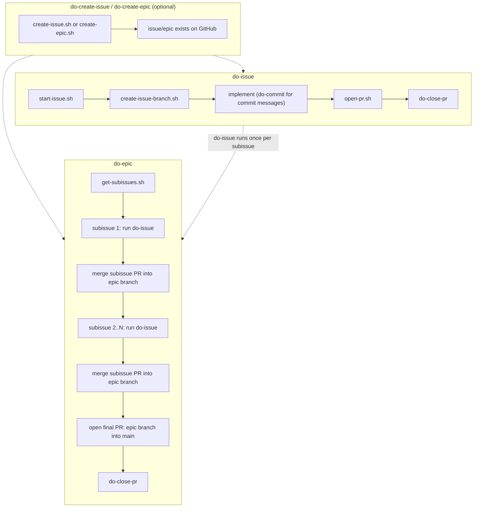

# tokenmaxer

Fable 5 shouldn't write commit messages, nor should it think about checking out branches or writing GraphQL queries for GitHub.

That is, frontier models should be used as little as possible.

# install

Interactive (prompts you to pick components):

```
curl -fsSL https://raw.githubusercontent.com/kurealnum/tokenmaxer/main/install.sh | bash
```

Non-interactive, specific components:

```
curl -fsSL https://raw.githubusercontent.com/kurealnum/tokenmaxer/main/install.sh | bash -s -- --components do-issue,do-commit
```

See `docs/installer.md` for the full component list, uninstall (`./uninstall.sh`), and update (`./install.sh --update`).

# how

- Script everything that can be deterministically evaluated, such as generating a branch name
- Offload non-deterministic work in a deterministic way. For example, generating a PR via a LLM with a script (_not_ a subagent)
- Avoid subagents, default commands such as `/review` from Claude Code, and situations that would require a LLM to iterate indefinitely, such as `/loop`
- Use skills (or other alternatives, such as custom harnesses) to use these scripts in an efficient manner
- Use no MCPs unless absolutely necessary
- Use token efficient harnesses (ex. [pi mono](https://github.com/earendil-works/pi), [omegon](https://github.com/styrene-lab/omegon))

This repository aims to help you accomplish all of the above.

# usage

Default skills/usage:

- `/do-issue #issue-number`
- `/do-epic #issue-number`
- `/do-create-issue`
- `/do-create-epic`
- `/do-commit`
- `/do-close-pr [pr-number]`

Skills are not intended to provide the full functionality of this repository. They are only wrappers around the internals.

Keep in mind that some scripts may need to be modified depending on your usecase. For example, `start-issue.sh` sets the `Status` field of an issue to `In Progress` via the Projects V2 API. If you're not using Projects, you may want to remove this.

## paradigms

There are currently two ways to use this repository to minimize token usage:

1. Completing an issue on GitHub via `/do-issue #issue-number`
2. Completing an epic (parent issue with subissues) on GitHub via `/do-epic #issue-number`

More usecases will be added in the future



# future work

- Using local LLMs to generate commit messages, PR titles, etc.
- Providing multiple paradigms as to how software projects can be built (see: `paradigms`)
- See `CONTRIBUTING.md`
