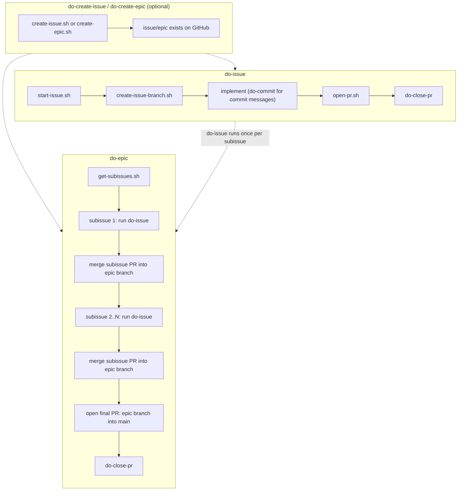

# tokenmaxer

Fable 5 shouldn't write commit messages, nor should it think about checking out branches or writing GraphQL queries for GitHub.

That is, frontier models should be used as little as possible.

# install

Interactive (prompts you to pick components):

```
curl -fsSL https://raw.githubusercontent.com/kurealnum/tokenmaxer/main/install.sh | bash
```

Non-interactive, specific components:

```
curl -fsSL https://raw.githubusercontent.com/kurealnum/tokenmaxer/main/install.sh | bash -s -- --components do-issue,do-commit
```

See `docs/installer.md` for the full component list and update (`./install.sh --update`).

## uninstall

Remove one component:

```
curl -fsSL https://raw.githubusercontent.com/kurealnum/tokenmaxer/main/uninstall.sh | bash -s -- do-commit
```

Remove everything installed:

```
curl -fsSL https://raw.githubusercontent.com/kurealnum/tokenmaxer/main/uninstall.sh | bash -s -- --all
```

Only removes files whose checksum still matches what was installed; hand-edited files are left in place.

# how

Do:

- Script everything that can be deterministically evaluated, such as generating a branch name
- Use skills (or other alternatives, such as custom harnesses) to use these scripts in an efficient manner
- Use token efficient harnesses (ex. [pi mono](https://github.com/earendil-works/pi), [omegon](https://github.com/styrene-lab/omegon))
- Use minimal models and minimal effort (ex. Sonnet 5 on Low effort)
- Meticulously plan all work; bug fixes, features, refactors, etc.
- Trim or completely remove CLAUDE.md and any skills that aren't absolutely necessary
- Offload non-deterministic work in a deterministic way. Ex. generating a PR via a local/extremely cheap LLM with a script (_not_ a subagent)

Avoid:

- MCPs
- Running high-context sessions without compacting/resetting. A _very rough_ rule of thumb is 20-30% of a model's maximum context.
- Subagents, default commands such as `/review` from Claude Code, and situations that would require a LLM to iterate indefinitely, such as `/loop`
- Automated code reviews and other automated LLM runs that might not be necessary.

This repository aims to help you accomplish all of the above.

# usage

Default skills/usage:

- `/do-issue`
- `/do-epic`
- `/do-create-issue`
- `/do-create-epic`
- `/do-commit`
- `/do-close-pr`

Skills are not intended to provide the full functionality of this repository. They are only wrappers around the internals.

Keep in mind that some scripts may need to be modified depending on your usecase. For example, `start-issue.sh` sets the `Status` field of an issue to `In Progress` via the Projects V2 API. If you're not using Projects, you may want to remove this.

## paradigms

There are currently two ways to use this repository to minimize token usage:

1. Completing/creating an issue on GitHub
2. Completing/creating an epic (parent issue with subissues) on GitHub
3. Closing PRs
4. Making commits via a local LLM

More usecases will be added in the future



# local LLM setup (do-commit)

`do-commit` generates commit messages with a local, OpenAI-compatible LLM server (LM Studio, Ollama's OpenAI endpoint, llama.cpp server, vLLM, etc) instead of a frontier model. Set these env vars (e.g. in your shell profile or a `.env` you source before use):

```
export LLM_BASE_URL=http://localhost:1234/v1   # default shown, optional
export LLM_MODEL=your-model-name               # required
export LLM_API_KEY=optional-key                # optional, if your server needs one
```

`LLM_BASE_URL`/`LLM_MODEL`/`LLM_API_KEY` come from whatever local server you're running — check its docs for the exact base URL and model name it exposes. See `docs/local-llm-commit.md` for more.

# future work

- Providing multiple paradigms as to how software projects can be built (see: `paradigms`)
- See `CONTRIBUTING.md`
